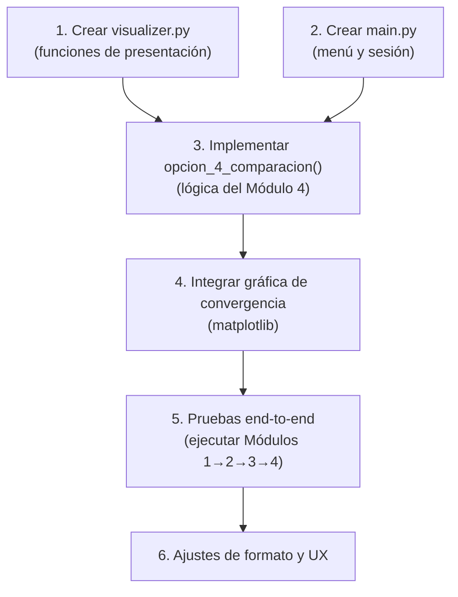

# 📊 Plan de Implementación — Módulo 4: Comparación de Resultados

## 1. Resumen Ejecutivo

El **Módulo 4** es el componente final del sistema que unifica los resultados de Hill Climbing (Módulo 2) y Simulated Annealing (Módulo 3) para generar una comparación visual, numérica y analítica. Este plan detalla cómo implementarlo de forma coherente con la arquitectura existente.

---

## 2. Estado Actual del Proyecto

### ✅ Componentes Implementados
| Archivo | Estado | Descripción |
|:---|:---:|:---|
| `src/config.py` | ✅ | Hiperparámetros globales (K=8 slots, λ=0.7, T₀=100, α=0.95, etc.) |
| `src/models/ad.py` | ✅ | Clase `Ad` (id, titulo, categoria, duracion, tasa_retencion_base, tags) |
| `src/models/user.py` | ✅ | Clase `UserProfile` con método `afinidad(ad)` (similitud coseno) |
| `src/models/slate.py` | ✅ | Clase `Slate` con `copy()`, indexación, repr |
| `src/core/cost_function.py` | ✅ | `calcular_fitness()`, `calcular_costo()`, factores de fatiga y posición |
| `src/core/neighborhood.py` | ✅ | Operadores `swap`, `replace`, `invert`, `generar_vecino()` |
| `src/algorithms/hill_climbing.py` | ✅ | `run_hill_climbing()` → retorna `HCResult` (dataclass) |
| `src/algorithms/simulated_annealing.py` | ✅ | `run_simulated_annealing()` → retorna `SAResult` (dataclass) |
| `src/utils/data_generator.py` | ✅ | Generación de catálogo (100 ads) y perfil de usuario sintéticos |
| `src/utils/data_loader.py` | ✅ | Carga de CSV/JSON y generación de slate inicial aleatorio |

### ❌ Componentes Faltantes (Necesarios para el Módulo 4)
| Archivo | Estado | Responsabilidad |
|:---|:---:|:---|
| `src/utils/visualizer.py` | ❌ Falta | Gráficas de convergencia y comparación visual |
| `src/main.py` | ❌ Falta | Menú interactivo en consola y orquestación de módulos |

---

## 3. Contratos de Datos Existentes

### 3.1 Estructura de `HCResult` (retorno de Hill Climbing)
```python
@dataclass
class HCResult:
    mejor_slate: Slate           # Mejor secuencia de anuncios encontrada
    costo_final: float           # Costo = -fitness (a minimizar)
    fitness_final: float         # Segundos de visualización retenida
    iteraciones_totales: int     # Iteración donde se detuvo (estancamiento o límite)
    evaluaciones_costo: int      # Total de evaluaciones de la función de costo
    historial_costos: list[float]   # Costo por iteración (para gráfica)
    historial_fitness: list[float]  # Fitness por iteración (para gráfica)
    movimientos_aceptados: int      # Nº de mejoras encontradas
    iteracion_estancamiento: int    # Iteración exacta del estancamiento
    log_movimientos: list[dict]     # Detalle de cada movimiento aceptado
```

### 3.2 Estructura de `SAResult` (retorno de Simulated Annealing)
```python
@dataclass
class SAResult:
    mejor_slate: Slate           # Mejor secuencia de anuncios encontrada
    costo_final: float           # Costo = -fitness (a minimizar)
    fitness_final: float         # Segundos de visualización retenida
    iteraciones_totales: int     # Total de pasos ejecutados
    evaluaciones_costo: int      # Total de evaluaciones de la función de costo
    peores_aceptadas: int        # Nº de soluciones peores aceptadas (escapes)
    historial_costos: list[float]   # Costo por iteración (para gráfica)
    historial_fitness: list[float]  # Fitness por iteración (para gráfica)
```

---

## 4. Especificación Detallada del Módulo 4

### 4.1 Requisitos (extraídos de `PLAN_PROYECTO.md` §7 — Módulo 4)

> [!IMPORTANT]
> El Módulo 4 debe cumplir estrictamente con estos requisitos del plan maestro:

1. **Validación previa:** Si HC o SA no se han ejecutado, alertar al usuario.
2. **Tabla comparativa** con:
   - Costo final de HC (resaltando estancamiento)
   - Costo final de SA (resaltando optimización lograda)
   - Tiempo de visualización retenido (segundos y minutos)
   - Porcentaje de mejora: `% Mejora = (Costo_HC - Costo_SA) / Costo_HC × 100%`
   - Total de iteraciones y evaluaciones de costo por método
3. **Explicación analítica** de la diferencia basada en el paisaje de fatiga.
4. **Gráfico de convergencia** `convergencia_hc_vs_sa.png` (opcional, activable por el usuario).

---

## 5. Archivos a Crear / Modificar

### 📁 Archivos Nuevos

```
src/
├── utils/
│   └── visualizer.py     ← NUEVO: gráficas matplotlib
└── main.py               ← NUEVO: menú interactivo y orquestación
```

### 📝 Archivos a Modificar

```
src/utils/__init__.py     ← Agregar exports del visualizer
```

---

## 6. Diseño Detallado de Cada Archivo

### 6.1 `src/utils/visualizer.py` — Motor de Visualización

```python
# Funciones a implementar:

def graficar_convergencia(
    hc_historial: list[float],
    sa_historial: list[float],
    tipo: str = 'costo',        # 'costo' o 'fitness'
    guardar: bool = True,
    filepath: str = 'convergencia_hc_vs_sa.png'
) -> None:
    """
    Genera gráfica dual de convergencia HC vs SA.
    - Eje X: Iteraciones
    - Eje Y: Costo (o Fitness)
    - Línea roja: Hill Climbing (con marcador de estancamiento)
    - Línea azul: Simulated Annealing
    - Leyenda, grilla, título descriptivo
    """

def mostrar_tabla_comparativa(
    hc_result: HCResult,
    sa_result: SAResult,
    costo_inicial: float,
    fitness_inicial: float
) -> None:
    """
    Imprime tabla formateada con tabulate/rich comparando ambos algoritmos.
    Incluye: costo final, fitness, iteraciones, evaluaciones, % mejora.
    """

def mostrar_composicion_slates(
    hc_result: HCResult,
    sa_result: SAResult
) -> None:
    """
    Muestra side-by-side la composición del slate óptimo de cada algoritmo.
    """

def mostrar_explicacion_diferencia(
    hc_result: HCResult,
    sa_result: SAResult
) -> None:
    """
    Imprime un análisis textual explicando POR QUÉ SA supera a HC
    basado en el paisaje de fatiga y la combinatoria de anuncios.
    """
```

#### Detalle de la gráfica de convergencia

```
                    Convergencia: Hill Climbing vs Simulated Annealing
    Costo ▲
          │    ████                                              
          │   █    ██████████████████████████  ← HC se estanca aquí
          │  █                                    (óptimo local)
          │ █    ▄▄▄▄
          ││   ▄    ▄▄▄▄
          ││  ▄        ▄▄▄▄▄
          │█ ▄              ▄▄▄▄▄▄▄▄▄▄▄▄▄▄▄  ← SA converge más bajo
          │█▄                                     (cuasi-óptimo global)
          └──────────────────────────────────► Iteraciones
          
    ── HC (Búsqueda Local)     ── SA (Búsqueda Estocástica)
```

### 6.2 `src/main.py` — Menú Interactivo y Orquestación

#### Estructura del menú (conforme a las directrices):
```
============================================
SISTEMA INTELIGENTE DE OPTIMIZACIÓN
Caso de Estudio: Recomendación de Anuncios Digitales
============================================
1. Cargar parámetros e inicializar escenario
2. Ejecutar algoritmo: Hill Climbing
3. Ejecutar algoritmo: Simulated Annealing
4. Ver comparación de resultados
5. Salir
============================================
Seleccione una opción:
```

#### Variables de sesión (estado global del menú):
```python
# Estado de sesión que persiste entre opciones del menú
session = {
    'catalogo': None,           # list[Ad]
    'user': None,               # UserProfile
    'slate_inicial': None,      # Slate (S₀ compartido)
    'costo_inicial': None,      # float
    'fitness_inicial': None,    # float
    'inicializado': False,      # bool
    'hc_result': None,          # HCResult | None
    'sa_result': None,          # SAResult | None
}
```

#### Flujo de la Opción 4 (Módulo 4):
```python
def opcion_4_comparacion(session: dict) -> None:
    """Módulo 4: Comparación de Resultados."""
    
    # 1. Validar que ambos algoritmos se hayan ejecutado
    if session['hc_result'] is None and session['sa_result'] is None:
        print("⚠️  ERROR: No se ha ejecutado ningún algoritmo.")
        print("   Ejecute primero las opciones 2 y 3 del menú.")
        return
    if session['hc_result'] is None:
        print("⚠️  ERROR: Hill Climbing no se ha ejecutado.")
        print("   Ejecute primero la opción 2.")
        return
    if session['sa_result'] is None:
        print("⚠️  ERROR: Simulated Annealing no se ha ejecutado.")
        print("   Ejecute primero la opción 3.")
        return
    
    # 2. Extraer resultados
    hc = session['hc_result']   # HCResult
    sa = session['sa_result']   # SAResult
    
    # 3. Mostrar tabla comparativa
    mostrar_tabla_comparativa(hc, sa, session['costo_inicial'], session['fitness_inicial'])
    
    # 4. Mostrar composición de slates
    mostrar_composicion_slates(hc, sa)
    
    # 5. Mostrar explicación analítica
    mostrar_explicacion_diferencia(hc, sa)
    
    # 6. Preguntar si desea guardar gráfico
    resp = input("¿Desea generar el gráfico de convergencia? (s/n): ")
    if resp.lower() == 's':
        graficar_convergencia(hc.historial_costos, sa.historial_costos)
```

---

## 7. Especificación de la Tabla Comparativa

### 7.1 Contenido obligatorio (§7 del plan maestro)

La tabla debe incluir las siguientes métricas exactas:

| # | Métrica | Hill Climbing | Simulated Annealing |
|:--|:--------|:--------------|:--------------------|
| 1 | Costo final | `hc.costo_final` | `sa.costo_final` |
| 2 | Fitness final (segundos) | `hc.fitness_final` | `sa.fitness_final` |
| 3 | Fitness final (minutos) | `hc.fitness_final / 60` | `sa.fitness_final / 60` |
| 4 | Iteraciones totales | `hc.iteraciones_totales` | `sa.iteraciones_totales` |
| 5 | Evaluaciones de costo | `hc.evaluaciones_costo` | `sa.evaluaciones_costo` |
| 6 | Movimientos aceptados | `hc.movimientos_aceptados` | N/A (distinto concepto) |
| 7 | Peores soluciones aceptadas | 0 (HC nunca acepta peores) | `sa.peores_aceptadas` |
| 8 | Punto de estancamiento | `hc.iteracion_estancamiento` | N/A (no se estanca) |

### 7.2 Fórmula del porcentaje de mejora

```python
# Nota: los costos son negativos (costo = -fitness), por lo que 
# un costo "mayor" (más negativo) es mejor.
# La fórmula del plan usa: (Costo_HC - Costo_SA) / Costo_HC * 100
# Con costos negativos: si SA es mejor → Costo_SA < Costo_HC (más negativo)
# → Costo_HC - Costo_SA > 0 → porcentaje positivo ✓

pct_mejora = ((hc.costo_final - sa.costo_final) / abs(hc.costo_final)) * 100

# Alternativa más intuitiva (en fitness, que son valores positivos):
pct_mejora_fitness = ((sa.fitness_final - hc.fitness_final) / hc.fitness_final) * 100
```

> [!WARNING]
> Los costos en este proyecto son **negativos** (`costo = -fitness`). La fórmula del plan maestro `(Costo_HC - Costo_SA) / Costo_HC × 100` debe usar `abs(Costo_HC)` en el denominador para obtener un porcentaje positivo cuando SA supera a HC.

### 7.3 Formato de salida esperado (con `tabulate`)

```
╔══════════════════════════════════╦═══════════════════╦══════════════════════════╗
║ Métrica                          ║ Hill Climbing     ║ Simulated Annealing      ║
╠══════════════════════════════════╬═══════════════════╬══════════════════════════╣
║ Costo final                      ║ -128.4521         ║ -156.8903                ║
║ Fitness (seg. retención)         ║  128.4521 s       ║  156.8903 s              ║
║ Fitness (minutos)                ║    2.14 min       ║    2.61 min              ║
║ Iteraciones totales              ║  312              ║ 5800                     ║
║ Evaluaciones de costo            ║  313              ║ 5801                     ║
║ Movimientos aceptados            ║   24              ║  N/A                     ║
║ Peores soluciones aceptadas      ║    0 (nunca)      ║  287 (escapes de bache)  ║
║ Punto de estancamiento           ║  Iter 312 ⚠️      ║  No aplica               ║
╠══════════════════════════════════╬═══════════════════╬══════════════════════════╣
║ % Mejora SA sobre HC             ║              22.15%                          ║
╚══════════════════════════════════╩══════════════════════════════════════════════╝
```

---

## 8. Explicación Analítica Automática

El módulo debe generar un análisis textual contextualizado. El texto debe:

1. **Describir el estancamiento de HC**: en qué iteración se estancó, cuántos vecinos evaluó sin mejora.
2. **Describir la estrategia de SA**: cuántas soluciones peores aceptó para escapar de óptimos locales.
3. **Explicar la causa raíz**: la función de fatiga crea un paisaje con múltiples mínimos locales donde cambios individuales (swap/replace) no mejoran el costo porque la sinergia entre posiciones es multi-dimensional.
4. **Comparar diversidad categórica** de ambos slates finales.

### Plantilla de texto generado:
```
══════════════════════════════════════════════════════════
 ANÁLISIS COMPARATIVO — ¿Por qué SA supera a HC?
══════════════════════════════════════════════════════════

 Hill Climbing se estancó en la iteración {iter_estancamiento} tras evaluar
 {max_stagnant} vecinos consecutivos sin encontrar mejora estricta.
 Logró aceptar solo {movimientos_aceptados} movimientos de mejora.

 Simulated Annealing, en cambio, aceptó {peores_aceptadas} soluciones 
 temporalmente peores gracias al criterio de Boltzmann (exp(-ΔC/T)).
 Esto le permitió escapar de {n_escapes} óptimos locales donde HC 
 habría quedado atrapado.

 La diferencia se explica por la naturaleza del paisaje de fatiga publicitaria:
 • La penalización γ_fatiga crea interdependencias entre slots:
   mover un solo anuncio puede empeorar el costo globalmente aunque
   localmente parezca neutro.
 • Para alcanzar una configuración con alternancia óptima de categorías,
   se requiere aceptar temporalmente configuraciones subóptimas
   (travesía por "valles" del paisaje de costos).
 • HC, al rechazar todo movimiento que no mejore estrictamente el costo,
   queda atrapado en la primera meseta que encuentra.

 Composición categórica comparada:
   HC: {distribucion_categorias_hc}
   SA: {distribucion_categorias_sa}
   SA logró mayor diversidad categórica, reduciendo la fatiga acumulada.
══════════════════════════════════════════════════════════
```

---

## 9. Plan de Implementación Paso a Paso

### Paso 1: Crear `src/utils/visualizer.py`

**Dependencias**: `matplotlib`, `tabulate` (ya en `requirements.txt`)

| Función | Líneas aprox. | Complejidad |
|:--------|:---:|:---:|
| `graficar_convergencia()` | 50-70 | Media |
| `mostrar_tabla_comparativa()` | 40-60 | Baja |
| `mostrar_composicion_slates()` | 30-40 | Baja |
| `mostrar_explicacion_diferencia()` | 50-70 | Media |
| `_calcular_distribucion_categorias()` | 10-15 | Baja |
| `_calcular_porcentaje_mejora()` | 5-10 | Baja |

**Total estimado**: ~200-260 líneas

#### Pseudocódigo de `graficar_convergencia`:
```python
import matplotlib.pyplot as plt

def graficar_convergencia(hc_historial, sa_historial, tipo='costo',
                          guardar=True, filepath='convergencia_hc_vs_sa.png'):
    fig, ax = plt.subplots(figsize=(12, 6))
    
    ax.plot(hc_historial, color='red', linewidth=1.5, label='Hill Climbing')
    ax.plot(sa_historial, color='blue', linewidth=1.5, alpha=0.8, 
            label='Simulated Annealing')
    
    # Marcar punto de estancamiento de HC
    # (donde la curva se aplana)
    
    ax.set_xlabel('Iteraciones')
    ax.set_ylabel('Costo' if tipo == 'costo' else 'Fitness (s)')
    ax.set_title('Convergencia: Hill Climbing vs Simulated Annealing')
    ax.legend()
    ax.grid(True, alpha=0.3)
    
    if guardar:
        plt.savefig(filepath, dpi=150, bbox_inches='tight')
        print(f"  Gráfico guardado en: {filepath}")
    
    plt.show()
```

### Paso 2: Crear `src/main.py`

**Estructura del archivo**:

```python
"""
Punto de entrada del sistema — Menú Interactivo en Consola.
Orquesta los 4 módulos del proyecto.
"""

# --- Imports ---
from src.utils.data_generator import (generar_catalogo, generar_perfil_usuario,
                                       guardar_catalogo_csv, guardar_perfil_json)
from src.utils.data_loader import (cargar_catalogo, cargar_perfil_usuario,
                                    generar_slate_inicial)
from src.algorithms.hill_climbing import run_hill_climbing
from src.algorithms.simulated_annealing import run_simulated_annealing
from src.core.cost_function import calcular_costo, calcular_fitness
from src.utils.visualizer import (graficar_convergencia, mostrar_tabla_comparativa,
                                   mostrar_composicion_slates, 
                                   mostrar_explicacion_diferencia)
from src import config

# --- Estado de sesión ---
session = { ... }

# --- Funciones del menú ---
def mostrar_menu(): ...
def opcion_1_inicializar(session): ...  # Módulo 1
def opcion_2_hill_climbing(session): ... # Módulo 2
def opcion_3_simulated_annealing(session): ... # Módulo 3
def opcion_4_comparacion(session): ...   # Módulo 4 ← FOCO PRINCIPAL

def main():
    while True:
        mostrar_menu()
        opcion = input("Seleccione una opción: ")
        if opcion == '1': opcion_1_inicializar(session)
        elif opcion == '2': opcion_2_hill_climbing(session)
        elif opcion == '3': opcion_3_simulated_annealing(session)
        elif opcion == '4': opcion_4_comparacion(session)
        elif opcion == '5': break

if __name__ == '__main__':
    main()
```

**Total estimado para main.py**: ~180-250 líneas

### Paso 3: Actualizar `src/utils/__init__.py`

Agregar los exports del visualizer para acceso limpio.

---

## 10. Detalles Técnicos de la Gráfica de Convergencia

### 10.1 Manejo de escalas diferentes en iteraciones

HC y SA pueden tener **cantidades de iteraciones muy diferentes** (HC: ~200-300, SA: ~5000+). Esto requiere un tratamiento especial:

```python
# Opción A: Normalizar el eje X al porcentaje de progreso [0%, 100%]
x_hc = np.linspace(0, 100, len(hc_historial))
x_sa = np.linspace(0, 100, len(sa_historial))

# Opción B (Recomendada): Ejes X independientes, doble escala
# Graficar ambos en sus escalas naturales con eje X dual
```

### 10.2 Anotaciones en la gráfica
- **Flecha** señalando el punto exacto de estancamiento de HC
- **Línea punteada horizontal** en el costo inicial (baseline)
- **Línea punteada horizontal** en el mejor costo de SA (meta alcanzada)
- **Sombreado** de la región de mejora entre HC final y SA final

### 10.3 Archivo de salida
- Formato: PNG a 150 DPI
- Nombre: `convergencia_hc_vs_sa.png`
- Ubicación: raíz del proyecto (`Proyecto_IA/`)

---

## 11. Manejo de Casos Borde

| Caso | Comportamiento Esperado |
|:-----|:------------------------|
| HC no ejecutado | Mensaje claro indicando ejecutar opción 2 primero |
| SA no ejecutado | Mensaje claro indicando ejecutar opción 3 primero |
| Ninguno ejecutado | Mensaje indicando ejecutar opciones 2 y 3 |
| Escenario no inicializado | Alertar que se debe ejecutar opción 1 primero |
| HC y SA obtienen el mismo costo | Reportar 0% de mejora con nota explicativa |
| SA obtiene peor resultado que HC | Reportar % de mejora negativo con explicación |
| Historiales de longitudes muy diferentes | Normalizar ejes en la gráfica |

---

## 12. Dependencias y Librerías

Todas las dependencias ya están declaradas en `requirements.txt`:

| Librería | Uso en Módulo 4 |
|:---------|:----------------|
| `matplotlib>=3.7.0` | Gráfica de convergencia |
| `tabulate>=0.9.0` | Tabla comparativa formateada |
| `numpy>=1.24.0` | Normalización de ejes, cálculos |

> [!NOTE]
> No se requiere agregar ninguna dependencia nueva. `rich` está disponible como alternativa a `tabulate` si se desea un formato más sofisticado.

---

## 13. Orden de Desarrollo Recomendado



### Estimación de Esfuerzo

| Paso | Tiempo Estimado | Responsable Sugerido |
|:-----|:---:|:---|
| Crear `visualizer.py` | 2-3 horas | Integrante 5 (Integrador) |
| Crear `main.py` completo | 2-3 horas | Integrante 5 (Integrador) |
| Implementar lógica Módulo 4 | 1-2 horas | Integrante 5 |
| Gráfica de convergencia | 1 hora | Integrante 5 |
| Pruebas end-to-end | 1-2 horas | Todos |
| **Total** | **7-11 horas** | — |

---

## 14. Validación y Checklist de Éxito

- [ ] `main.py` muestra el menú exacto del diagrama de las directrices
- [ ] La opción 4 alerta si no se ejecutaron HC y/o SA previamente
- [ ] La tabla comparativa muestra las 8+ métricas requeridas
- [ ] El porcentaje de mejora se calcula correctamente con la fórmula del plan
- [ ] Se muestra el tiempo de visualización en segundos Y minutos
- [ ] Se resalta el punto de estancamiento de HC
- [ ] Se resalta la capacidad de SA de escapar óptimos locales
- [ ] Se incluye explicación analítica del paisaje de fatiga
- [ ] El gráfico `convergencia_hc_vs_sa.png` se genera correctamente
- [ ] Ambas curvas se visualizan claramente en la gráfica
- [ ] El sistema funciona end-to-end: opción 1 → 2 → 3 → 4
- [ ] SA supera sistemáticamente a HC en los resultados

---

## 15. Notas de Integración Importantes

> [!TIP]
> **Sobre la fórmula del porcentaje de mejora**: dado que `calcular_costo()` retorna `-fitness` (valores negativos), al calcular `(Costo_HC - Costo_SA) / Costo_HC`, el denominador es negativo. Usar `abs()` en el denominador para obtener el signo correcto del porcentaje.

> [!IMPORTANT]
> **Sobre la solución inicial compartida**: `main.py` debe guardar el `slate_inicial` generado en la opción 1 y pasarlo **idéntico** a ambos algoritmos en las opciones 2 y 3. Esto ya está contemplado en la variable de sesión `session['slate_inicial']`.

> [!NOTE]
> **Sobre `verbose=True`**: Ambos algoritmos ya imprimen trazas detalladas cuando `verbose=True`. El Módulo 4 agrega la capa de comparación **posterior** a la ejecución, leyendo los objetos `HCResult` y `SAResult` almacenados en la sesión.
